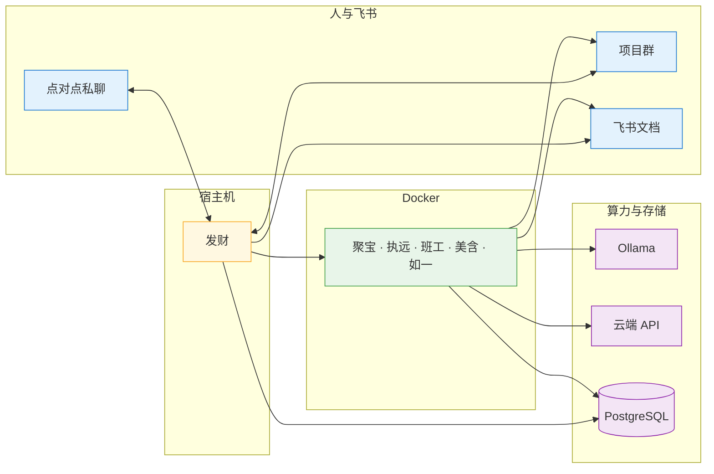
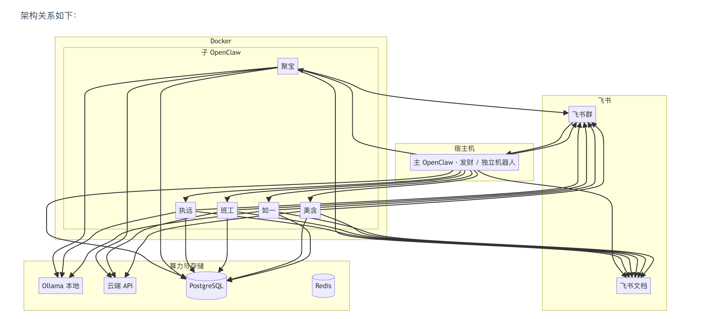

# 技术实现

本章描述在 **OpenClaw + Mac Mini** 上落地多 Agent 体系的算力配置、数据与通信、执行侧实现及部署步骤，对应“单引擎、多灵魂”方案。

---

## 与 OpenClaw 的集成方式

本架构以 **飞书** 为指挥与协同入口。**OpenClaw 已支持飞书机器人进行消息交互**，飞书消息可直接与 Gateway 对接。

### 人与 Agent 的飞书交互逻辑（设定说明）

- **日常：点对点（人对机器人）**  
  **发财** 是独立飞书机器人。**大部分时候**人与发财通过**飞书点对点（私聊）**沟通：需求下达、进度查询、审批确认等，均在这一通道完成。

- **项目：项目群**  
  只有在**创建某个项目后**才会拉一个**项目群**，与该项目相关的岗位（聚宝、执远、班工、美含、如一中的部分或全部）被拉进该**项目群**。在项目群内：发财 **@** 子 Agent 下发工单，子 Agent 在群内**响应与汇报**进度；人也可在群内 @ 发财或 @ 某子 Agent，信息仍汇总到发财统一判断后执行。

- **飞书文档**  
  **所有 Agent（发财 + 5 个子角色）均可操作飞书文档**，用于归档产出、知识库与多维表格；工单约定中的「资产 100% 入库」依赖此能力。

该设定在 OpenClaw 下的合理性简述：**点对点为主** 符合日常轻量沟通；**按项目建群** 使协作边界清晰、可追溯；**人 @ 谁都经发财统一判断** 保证调度权集中；**全员可写飞书文档** 与「文档驱动、资产归档」一致。

- **主从结构**：**主 OpenClaw（发财）** 对接飞书（独立机器人），负责接收指令、派单与调度；**聚宝、执远、班工、美含、如一** 为 **Docker 上运行的子 OpenClaw 实例**，在飞书群内响应与汇报，由主 OpenClaw（发财）按工单路由到对应子实例执行。
- 工单与 tx_id 由 PostgreSQL 与自建服务维护；主 OpenClaw 不替代工单存储与状态机，只负责入口与调度。

架构关系如下（分层简化示意）：



*日常以「人 ↔ 发财」点对点为主；创建项目后拉项目群，发财在群内 @ 子 Agent 派单，子 Agent 在群内汇报并写飞书文档。工单与状态由 PostgreSQL 维护。*

---

## 一、算力底座 (Inference Engine)

针对 **Mac Mini M4 (24G 内存)** ：物理层跑一个本地模型，逻辑层通过不同宪法 (System Prompt) 区分角色。

- **本地模型**：`Qwen2.5-14B-Instruct-Q4_K_M`（约 9.5GB），为 Ollama 多角色共用。
- **部署**：`ollama run qwen2.5:14b`

---

## 二、主 OpenClaw（发财）+ 子 OpenClaw（Docker）

- **主 OpenClaw（发财）**：部署在宿主机，对应**独立飞书机器人**。**日常**与人**点对点（私聊）**沟通需求与汇报；**创建项目后**在**项目群**内接收消息（人 @ 发财或 @ 其他 agent 时统一经发财）、按工单派发给对应子 OpenClaw。宪法为 [01-角色与宪法](01-角色与宪法.md) 中发财的定义。
- **子 OpenClaw（聚宝、执远、班工、美含、如一）**：各角色在 **Docker** 上独立运行，**仅进入项目群**（被拉入对应项目群），在群内被发财 @ 收工单、响应与汇报进度，并操作飞书文档做归档。本地角色对接 Ollama，云端角色对接 Claude/GPT 等。
- **流量**：日常 人 ⇄ 发财（点对点）；有项目时 人/群消息 → **发财** 统一判断 → 派单到 **子 OpenClaw** → 子实例在**项目群**内汇报、写**飞书文档**，回写 DB。

---

## 三、数据与状态

### 3.1 PostgreSQL：事务与状态机

所有 Agent 共享 [Global DB]，核心表支持断点续传：

```sql
CREATE TABLE agent_transactions (
    tx_id UUID PRIMARY KEY,
    project_id VARCHAR(50),
    actor_name VARCHAR(20),
    action_type VARCHAR(50),
    payload JSONB,
    status VARCHAR(20),  -- PENDING, SUCCESS, FAIL
    created_at TIMESTAMP DEFAULT CURRENT_TIMESTAMP
);
```

### 3.2 【执远】本地执行

- **技术栈**：Python + Playwright + Ollama API。
- **流程**：接收工单 → 本地 qwen2.5:14b 解析为操作步骤 → 驱动 Chrome 执行（发货、下架等）。执远需跑在宿主机以操作本地浏览器，不放入 Docker。

### 3.3 飞书与 OpenClaw

**OpenClaw 已支持飞书机器人**，飞书消息可直接与 Gateway 交互。若需工单解析、飞书 UserID 白名单、或投递至内部 PostgreSQL/Redis 总线，可在 OpenClaw 前叠加自建适配层；否则可直接使用 OpenClaw 的飞书 Channel 配置（如 `channels.feishu` 等，以官方文档为准）。

### 3.4 长期记忆与向量检索 (memory-lancedb-pro)

多 Agent 的**长期记忆**与**上下文节流**建议采用 OpenClaw 生态插件 [memory-lancedb-pro](https://github.com/win4r/memory-lancedb-pro)：基于 LanceDB 的增强记忆插件，支持混合检索（Vector + BM25）、Cross-Encoder 重排、多 Scope 隔离，与 OpenClaw 的 Multi-agent 路由天然契合。

- **多 Scope 隔离**：主 OpenClaw（发财）与各子 OpenClaw（Docker）可各自或共享 memory 插件；若共享，可为 6 个角色配置 `agent:<id>`（如 `agent:发财`、`agent:聚宝`）及 `global`，在对应 `openclaw.json` 的 `plugins.entries["memory-lancedb-pro"].config.scopes.agentAccess` 中指定可访问的 scope，避免跨角色记忆污染。
- **工单上下文节流**：工单中的 `context_throttle.summary` 可由 **memory_recall** 按 project/scope 检索得到的高相关记忆组成（≤500 Token 快照），替代全量历史，符合 [04 经济、审计与安全](04-经济审计与安全.md) 中的 Token 节流要求。
- **能力概览**：插件提供 `memory_store`、`memory_recall`、`memory_forget` 等 Agent 工具；支持 Auto-Capture（会话结束自动提炼事实/决策）与 Auto-Recall（会话开始注入相关记忆）；Embedding 可选用 Ollama 本地模型（如 `nomic-embed-text`）或云端 Jina/OpenAI，与现有算力分层一致。
- **部署要点**：将插件克隆到 OpenClaw workspace 的 `plugins/` 下，在 `openclaw.json` 中配置 `plugins.load.paths`、`plugins.slots.memory` 指向该插件，并设置 `embedding`（如 Ollama baseURL + model）与 `dbPath`（默认 `~/.openclaw/memory/lancedb-pro`）。仅可启用一个 memory 插件，若启用 memory-lancedb-pro 则需关闭内置 `memory-lancedb`。

### 3.5 Agent 进化：个体 + 团队协作 (Stability + Capability Evolver + 协作闭环)

目标有两层：**各 Agent 自身进化**（稳定性 + 能力修复/记忆更新）与 **团队协作进化**（工单流转、路由规则、跨角色经验的持续优化）。

- **Stability 插件（个体运行稳定性）**  
  [openclaw-plugin-stability](https://github.com/CoderofTheWest/openclaw-plugin-stability) 作为 OpenClaw **Gateway 插件**接入。主 OpenClaw（发财）与各子 OpenClaw（Docker）可分别在各自实例的 `openclaw.json` 中配置 `plugins.load.paths` 启用该插件，为对应实例提供熵值监测、意识注入、循环检测与高熵事件写入记忆。

- **Capability Evolver / GEP（个体能力进化）**  
  通过 **Playbooks Skill** 安装自我进化引擎，与 OpenClaw 配合使用（非 Gateway 插件）：
  - **[capability-evolver](https://playbooks.com/skills/openclaw/skills/capability-evolver)**：扫描运行时历史与内存，识别失败或低效模式，自主编写新代码或更新记忆以改进表现；支持 `node index.js`（立即执行）、`--review`（人工确认）、`--loop`（循环，适合 Cron）；可与 memory-lancedb-pro 的 `memory_store` 配合沉淀**个体**经验（写入各 agent 的 scope 或 global）。
  - 安装：`npx playbooks add skill openclaw/skills --skill capability-evolver`；可选环境变量如 `EVOLVE_STRATEGY`（balanced / repair-only 等）、`EVOLVE_REPORT_TOOL`（如飞书汇报）。
  - **EvoMap / GEP 协议（可选）**：若需跨 Agent 或跨团队共享经验，可安装 [evomap-gepa2a](https://playbooks.com/skills/openclaw/skills/evomap-gepa2a) 等 Skill，接入 EvoMap 协作进化市场（Gene/Capsule 发布与积分）；与本公司 6 Agent 的闭环复盘可并行使用。

- **团队协作进化（核心）**  
  在个体进化之上，显式设计**协作层**的持续优化，避免“各练各的、协作方式不变”：
  - **global 记忆沉淀协作经验**：将「跨角色」的教训与最佳实践写入 memory-lancedb-pro 的 **scope=global**（如：某类工单应抄送【如一】、聚宝→班工 的常见返工原因、执远与班工对接时的字段约定）。各 Agent 在生成或处理工单前通过 `memory_recall` 检索 global，使路由、抄送、工单模板随团队经验演进。
  - **复盘产出协作规则**：每日 EOD 复盘（见 [02-协作与运行](02-协作与运行.md)）除审计结论外，增加**协作改进项**——例如「某项目因未抄送分析岗导致重复分析」「某类任务应优先派给执远而非班工」。这些结论由【如一】或复盘脚本归纳后：① 写入 global 记忆（memory_store，scope=global）；② 或更新团队级配置/Playbook（如路由规则表、工单模板版本），供下一日工单与路由使用。
  - **GEP Capsule 编码团队流程**：GEP 的 Capsule 可表示「多角色协作的完整方案」（如：立项申请 → 聚宝发起、发财审批、班工/美含/如一 入场的时序与交付物）。capability-evolver 或专项任务在复盘后，根据当日成功/失败案例更新或新增团队级 Capsule，使「立项→执行→审计」的整体流程随实践优化。
  - **可演进的路由与工单约定**：路由规则（谁可派给谁、何种工单必须 cc 谁）、工单字段约定（context_throttle 的必填项）存放在配置或 PostgreSQL 中，复盘或 capability-evolver 的输出可写入这些存储，实现协作协议本身的迭代。

- **与复盘的配合**：每日 23:00 的 EOD 复盘产出**个体侧**审计结论与**协作侧**改进建议；capability-evolver 定期基于会话/记忆与 GEP 资产运行；**协作侧**将复盘结论写入 global 记忆与团队配置/Capsule，形成「复盘 → 个体记忆/代码更新 + 协作规则/global 记忆更新 → 下次执行与工单生成读取」的双层进化闭环。

---

## 四、资源与部署

### 4.1 24G 内存分配（参考）

| 资源项 | 预算 | 说明 |
|--------|------|------|
| macOS | 4.5 GB | 系统 |
| Ollama (Qwen-14B) | 9.5 GB | 多角色共用 |
| Chrome (淘宝后台) | 3.0 GB | 执远操作 |
| Postgres/Redis | 2.0 GB | Docker 基础服务；长期记忆由 memory-lancedb-pro 提供，LanceDB 存于 `~/.openclaw/memory/` |
| 主 OpenClaw（发财）| 0.5 GB | 宿主机，对接飞书与派单 |
| 子 OpenClaw x 5（Docker）| 1.0 GB | 聚宝/执远/班工/美含/如一，各一实例 |
| 缓冲 | 3.5 GB | 防掉线 |

### 4.2 落地步骤

1. **宿主机**：安装 Ollama、Node.js 22、Python 3.11。
2. **数据中枢**：Docker Compose 启动 PostgreSQL、Redis。
3. **OpenClaw 配置**：**主 OpenClaw（发财）** 配置在宿主机（如 `~/.openclaw/openclaw.json`），对接飞书并实现派单逻辑；**5 个子 OpenClaw** 各在 Docker 容器内维护自己的配置（或挂载各自 openclaw.json），宪法与 model 按角色注入（发财/聚宝/执远/班工/美含/如一），主节点将工单路由到对应子实例。多角色宪法路径等扩展可与该路径或项目配置目录一并管理。
4. **Control UI**：OpenClaw Control UI 默认地址为 `http://127.0.0.1:18789/`；建议仅本地或通过 Tailscale/VPN 访问，并与 04 中 Control UI 强密码、访问控制等配合使用。
5. **长期记忆（可选）**：主 OpenClaw 与各子 OpenClaw 可分别或共享安装 [memory-lancedb-pro](https://github.com/win4r/memory-lancedb-pro)，在各自 `openclaw.json` 中设置 `plugins.slots.memory` 并配置 `scopes.agentAccess`（如各角色访问 `global` + 自身 `agent:<id>`）；Embedding 可用 Ollama 本地或 Jina 等云端 API。
6. **自我进化（可选）**：  
   - **Stability**：将 [openclaw-plugin-stability](https://github.com/CoderofTheWest/openclaw-plugin-stability) 克隆到主 OpenClaw 与各子 OpenClaw 的 workspace `plugins/` 并加入各自 `openclaw.json` 的 `plugins.load.paths`，重启各实例后生效。  
   - **Capability Evolver**：`npx playbooks add skill openclaw/skills --skill capability-evolver`；按需以 Cron 运行（如 `node index.js --loop` 或 `--review`），与每日复盘配合形成闭环；可选配置 `EVOLVE_STRATEGY`、`EVOLVE_REPORT_TOOL`（如飞书卡片）。
7. **复盘与协作进化**：Cron 每日 23:00 执行 EOD 脚本（见 [02-协作与运行](02-协作与运行.md)）；复盘输出中增加协作改进项，并写入 memory-lancedb-pro 的 scope=global 或团队路由/工单配置，实现团队协作的持续进化。

---

**方案评价**：单模型多角色避免内存挤占；本地核心角色零边际成本；敏感数据不出本机，适合电商后台场景。
